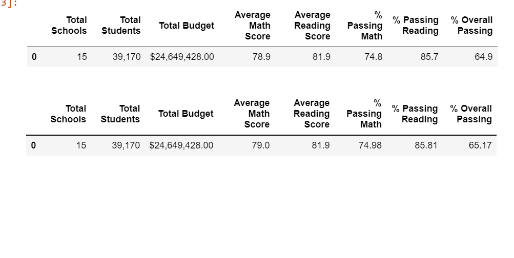
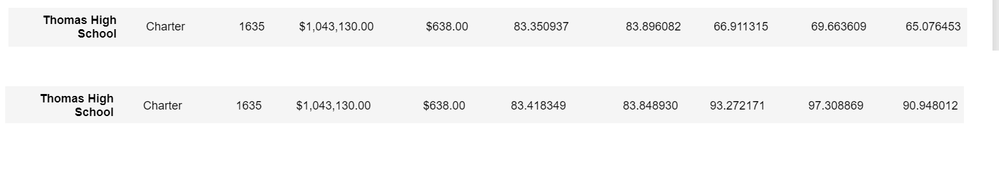

# School_District_Analysis

## Overview of the School District Analysis
  The purpose of this analysis was to replace the math and reading scores for the ninth graders from Thomas High School with NaNs while keeping the rest of the data intact and repeat the school district analysis to determine how these changes affected the overall analysis.
  
## School District Analysis Results
  - The District summary was slightly impacted due to removing the ninth grade math and reading scores from Thomas High School. 
  - The School summary was heavily impacted due to removing the ninth grade math and reading scores from Thomas High School, raising each % passing percentage by about 25 points. 
  - Replacing the ninth graders math and reading scores barely affected Thomas High Schools' perfomance level at all. All scores and percentages changed less than 1%.
  - Replacing the ninth-grade scores did not affect any other schools or grades in any way. the only thing that was differnet for both math and reading scores was that the ninth grade column for Thomas High are both now NAN.
 - There was no impact on the scores by school spending.
 - There was no impact on the scores by school size.
 - There was no impact on the scores by school type.
  

## Updated School District Summary
Four changes in the updated school distract analysis after the reading and math scores for the ninth grade at Thomas High School had been replaced with NaNs are that the '% Passing Math', '% Passing Reading' and '% Overall Passing' changed and increased by 25 points, and also that the amount of total students at the school changed.

